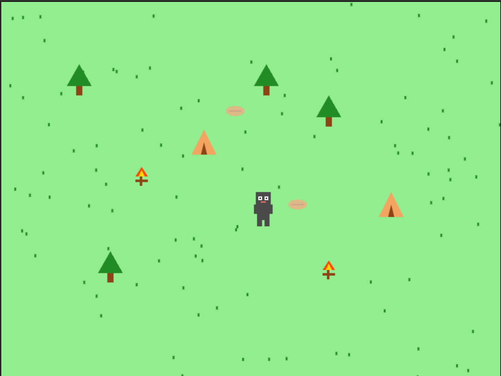

# Sneaky Sasquatch Game

A simple 2D game based on HTML5 Canvas where players control a Sasquatch exploring the forest.

## Game Features

- Control the Sasquatch using arrow keys
- Rich game scene elements:
    - Trees
    - Tents
    - Campfires (with animation effects)
    - Food (apples and bread)
- Smooth animation effects
- Randomly generated grass background

## Screenshot



## Tech Stack

- HTML5 Canvas
- Pure JavaScript (Object-Oriented Programming)
- Basic CSS styling

## How to Run

1. Clone the project
```bash
git clone [your repository URL]
```

2. Open the `index.html` file directly in the browser or run it using a local server

## Game Controls

- ↑: Move up
- ↓: Move down
- ←: Move left
- →: Move right

## Project Structure

- `index.html`: Main game page
- `game.js`: Main game logic
- `player.js`: Player character class
- `obstacle.js`: Scene obstacle class
